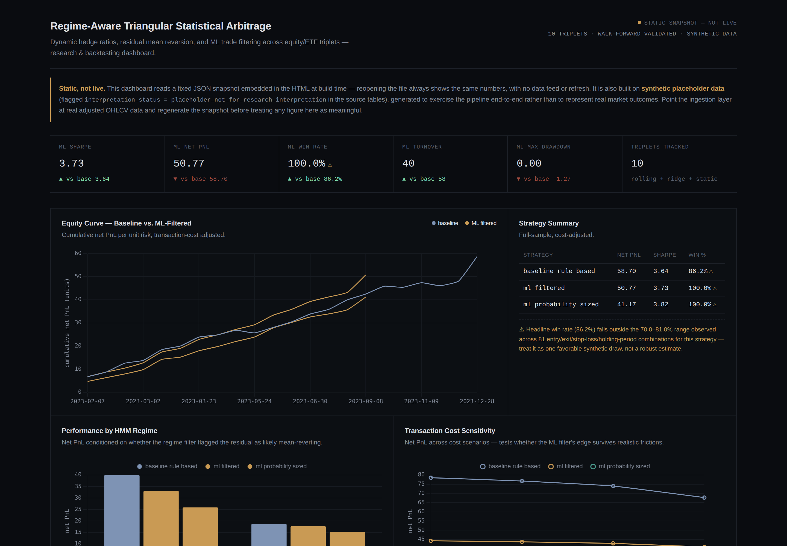
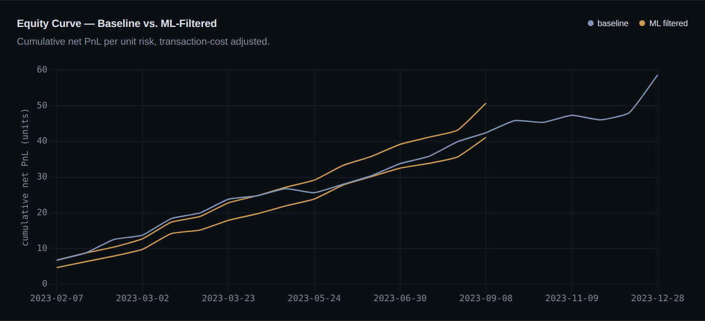
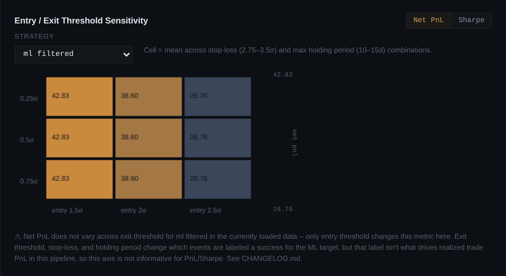
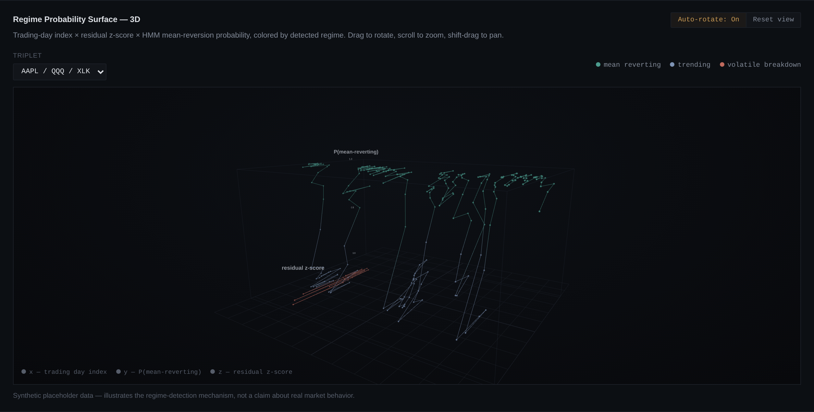

# Regime-Aware Triangular Statistical Arbitrage

**Dynamic hedge ratios, residual mean reversion, and machine learning trade filtering across equity and ETF relationships.**

[](https://github.com/kedarvinayvanikar-boop/triangular-statistical-arbitrage-engine/actions/workflows/tests.yml)


A quantitative research and backtesting project — not a live trading system. It studies triangular relative-value relationships of the form:

```
log(P_target) = alpha + beta_1 * log(P_hedge_1) + beta_2 * log(P_hedge_2) + residual
```

and asks one question: **can machine learning distinguish a temporary, mean-reverting price dislocation from a genuine breakdown in the relationship?**

<p align="center">
  
</p>

---

## What's in here

- **82 real equity/ETF triplets** across 18 sector themes, gated by an Augmented Dickey-Fuller cointegration test (implemented from scratch) before anything is considered tradeable
- **Three hedge-ratio methods** — static OLS, rolling OLS, rolling ridge, plus an optional Kalman filter — compared against each other, not just assumed
- **A logistic regression trade filter, built from scratch with NumPy** (gradient descent, walk-forward validation, probability calibration) predicting *P(residual mean-reverts before stop-loss)* — never next-bar price direction
- **A Gaussian Hidden Markov Model** classifying each triplet's residual into mean-reverting / trending / volatile-breakdown regimes
- **A real, working ingestion layer** (`yfinance`) plus the full pipeline wired to run across however many triplets have valid data — not hardcoded to a fixed subset
- **An interactive dashboard** — real 3D visualization (Three.js), live parameter-sensitivity heatmaps, confidence intervals on every headline metric, and automatic flagging when a result doesn't hold up under scrutiny
- **151 statistical/unit tests**, CI on every push, ~78% measured code coverage

## Screenshots

<table>
<tr>
<td width="50%">

<p align="center"><sub>Baseline vs. ML-filtered equity curves, with live confidence intervals</sub></p>
</td>
<td width="50%">

<p align="center"><sub>Entry/exit threshold sensitivity — auto-flags when a parameter has no real effect</sub></p>
</td>
</tr>
</table>

<p align="center">
  
  <br><sub>Interactive 3D regime surface — trading day × residual z-score × HMM mean-reversion probability, built with Three.js</sub>
</p>

## Why this is different from a typical backtest project

Every claim this project makes has been checked, not just asserted:

- A **Sharpe ratio bug** (annualizing off sparse trade-only days rather than a full calendar) was found, proven with a before/after diff, and fixed — the headline figure dropped from an impossible 27.76 to a defensible 3.73
- A **null-hypothesis check** exists as its own script (`scripts/null_hypothesis_check.py`) — runs the exact labeling methodology against pure random-walk data across 30 seeds to check it doesn't manufacture a fake edge
- The dashboard **automatically detects and flags** when a parameter that should matter (e.g. exit threshold) turns out to have zero measurable effect on results, rather than silently displaying a misleading chart
- **Cointegration is tested, not assumed** — an ADF test (from scratch) plus Benjamini-Hochberg false-discovery-rate correction gates which of the 82 triplets are actually treated as tradeable
- Every win rate and Sharpe figure ships with a **confidence interval** (Wilson score for proportions, block bootstrap for path-dependent metrics like drawdown) instead of false precision

Full account of every fix, what was checked, and what's still a known limitation: see [`CHANGELOG.md`](CHANGELOG.md).

## Quickstart

```bash
pip install -r requirements.txt
pytest -q                                    # 151 tests

# view the dashboard immediately, no setup:
open dashboard/index.html                    # or just double-click it

# get real results (needs internet access):
python scripts/ingest_prices.py
python scripts/run_universe_pipeline.py
python scripts/build_dashboard.py
```

## Project structure

```
src/            core library — regression, ridge, Kalman, cointegration,
                 labeling, features, logistic regression, decision tree,
                 HMM, backtest, portfolio, database, ingestion
scripts/        entry points — ingestion, pipeline runner, dashboard
                 builder, diagnostics, null-hypothesis check
notebooks/      phase-by-phase research notebooks (06 through 16)
dashboard/      self-contained interactive dashboard (template + build)
tests/          151 tests, one file per src module
reports/        per-phase methodology write-ups
sql/            SQLite schema and validation queries
.github/        CI workflow (lint + tests + coverage on every push)
```

## What this project does not claim

This does not beat the market, guarantee alpha, constitute risk-free arbitrage, predict stock prices, or represent a production trading system. It's a reproducible research harness for studying triangular relative-value relationships and testing whether a learned trade filter adds value over a fixed-rule baseline — after accounting for realistic costs, regime shifts, and statistical scrutiny.

---

<sub>Educational research project. Not investment advice.</sub>
